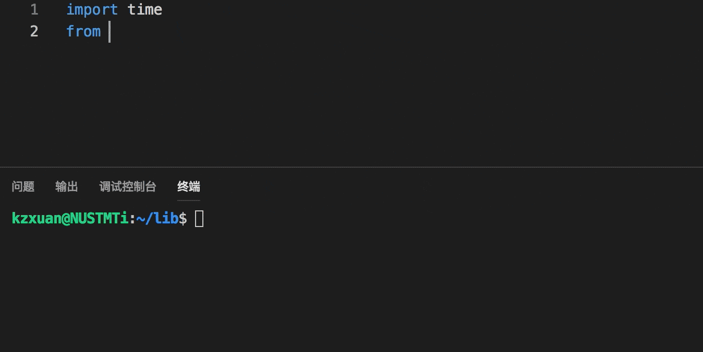
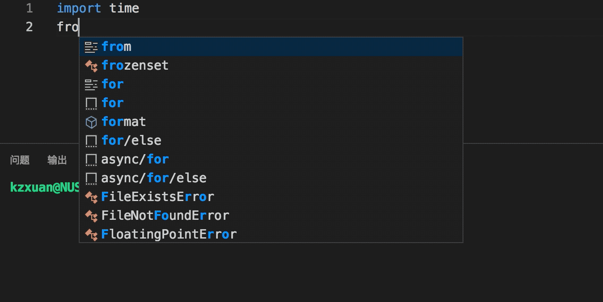
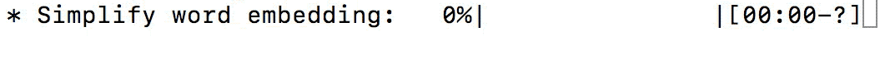

## Utilities by Python

by KzXuan

</br>

#### Display Tool ([display_tool.py](./display_tool.py))

* **timer (计时器)**：Timing for program.

  ```python
  from display_tool import timer
  
  timer.start(desc="* Record run time")
  # Do anything here.
  timer.stop()
  ```

  <div align='center'>
  
  </div>


* **dot (等待器)**：Waiting for completion and print dots.

  ```python
  from display_tool import dot
  
  """Usage 1"""
  dot.start(desc="* Loading a file")
  # Do anything here.
  dot.stop()
  
  """Usage 2"""
  @dot(desc="* Loading a file")
  def load():
      # Do anything here.
  load()
  ```

  <div align='center'>
  
  </div>


* **slash (闪烁器)**：Waiting for completion and print spinner.

  ```python
  from display_tool import slash
  
  """Usage 1"""
  slash.start(desc="* Loading a file")
  # Do anything here.
  slash.stop()
  
  """Usage 1"""
  @slash(desc="* Loading a file")
  def load():
      # Do anything here.
  load()
  ```

  <div align='center'>
  
  </div>

* **bar (进度条)**：Progress bar when looping (with **tqdm**).

  ```python
  from display_tool import bar
  
  """Usage 1"""
  for i in bar(100, desc="* Make a loop"):
      # Do anything here.
  
  """Usage 2"""
  l = list(range(100))
  for i in bar(l, desc="* Make a loop"):
      # Do anything here.
  ```

  <div align='center'>
  
  </div>

  ```python
  """Usage 3"""
  for i in bar(4, desc="* Loop 1"):
      for j in bar(100, desc="* Loop 2", leave=False):
          # Do anything here.
  ```

  <div align='center'>
  
  </div>

* **table (表格)**：Print table line-by-line.

  ```python
  from display_tool import table
  
  """Usage 1"""
  t = table(col=4, ndigits=2)
  t.row([0, 0, 0, 0])
  t.row([1, 0.8, 0.9, 0.85])
  t.row([2, 0.8223, 0.8994, 0.8591])
  t.row([30, "Error!", "Error!", "Error!"])
  ```

  <div align='center'>
  
  </div>

  ```python
  """Usage 2"""
  t = table(col=['Epoch', 'P', 'R', 'F'], place='>', ndigits=4)
  t.row([0, 0, 0, 0])
  t.row([1, 0.8, 0.9, 0.85])
  t.row({'Epoch': 2, 'P': 0.8223, 'R': 0.8994, 'F': 0.8591})
  t.row([3000000000, "Error!", "Error!", "Error!"])
  ```

  <div align='center'>
  
  </div>

</br>

#### Predict Analysis ([predict_analysis.py](./predict_analysis.py))

* Get all evaluation metrics, including Accuracy, macro/micro-P/R/F, based on real labels and classification prediction.

  ```python
  from predict_analysis import prfacc
  
  true = [1, 0, 1, 1, 2, 1, 0]
  pred = [0, 1, 1, 2, 2, 2, 1]
  get = prfacc.analysis(true, pred, one_hot=False, ndigits=4)
  tab = prfacc.tabular(class_name=['pos', 'neu', 'neg'])
  ## get:
  {
      'Acc': 0.2857, 'Correct': array([0, 1, 1]),
      'C0-P': 0.0, 'C1-P': 0.3333, 'C2-P': 0.3333, 'Mi-P': 0.2857, 'Ma-P': 0.2222,
      'C0-R': 0.0, 'C1-R': 0.25, 'C2-R': 1.0, 'Mi-R': 0.2857, 'Ma-R': 0.4167,
      'C0-F': 0.0, 'C1-F': 0.2857, 'C2-F': 0.5, 'Mi-F': 0.2857, 'Ma-F': 0.2898
  }
  ## tab:
            pos     neu     neg micro/avg macro/sum
  correct     0       1       1    0.6667         2
  predict     1       3       3    2.3333         7
  label       2       4       1    2.3333         7
  precision   0  0.3333  0.3333    0.2857    0.2222
  recall      0    0.25       1    0.2857    0.4167
  f1-score    0  0.2857     0.5    0.2857    0.2898
  accuracy                                   0.2857
  ```

</br>

#### Word Vector ([word_vector.py](./word_vector.py))

* Load word embedding file and check a word.

  ```python
  import word_vector as wv
  
  w2v = wv.load_w2v("./Glove_w2v.txt", type='txt', header=True, check_zero=True)
  ## w2v["hello"]:
  [ 3.4683e-01 -1.9612e-01 ... 8.2294e-02 -5.4478e-01]
  ## w2v.index["hello"]:
  1826
  ```

  <div align='center'>
  
  </div>

* Simplify word embedding file with task word list.

  ```python
  words = ["hello", ..., "you"]
  sim_w2v = wv.simplify_w2v(w2v, words, out_file="./task_w2v.txt", rand_not_in=False)
  ```

  <div align='center'>
  
  </div>

* Convert a text to vector, by mean/max value, joint connect or index query.

  ```python
  text = ["hello", "how", "are", "you", "."]
  """Usage 1"""
  vector = wv.text_vector(text, w2v, mode='mean')
  ## vector:
  [ 3.37970000e-01  1.61538168e-01 ... -1.16186400e-01  7.80512000e-02]
  
  """Usage 2"""
  vector, length = wv.text_vector(text, w2v, mode='index', padding=10)
  ## vector:
  [ 2210  9327  6758 14882 15747     0     0     0     0     0]
  ## length:
  5
  ```

* Convert a document to matrix.

  ```python
  doc = [
      ["hello", "how", "are", "you", "."],
      ["I", "am", "fine", ",", "thank", "you", "."]
  ]
  """Usage 1"""
  vector, doc_length = wv.doc_vector(doc, w2v, mode='max', padding=3)
  
  ## vector:
  [[ 3.37970000e-01  1.61538168e-01 ... -1.16186400e-01  7.80512000e-02]
   [ 7.40816667e-02  1.06451640e-01 ... -1.59695167e-01  1.59934333e-01]
   [ 0.00000000e+00  0.00000000e+00 ...  0.00000000e+00  0.00000000e+00]]
  ## doc_length:
  2
  
  """Usage 2"""
  vector, doc_length, sen_length = wv.doc_vector(doc, w2v, mode='index', padding=3)
  ## vector:
  [[ 2210.  9327.  6758. 14882. 15747.     0.     0.]
   [14381. 12643. 37101. 13862. 14882. 15747.     0.]
   [    0.     0.     0.     0.     0.     0.     0.]]
  ## doc_length:
  2
  ## sen_length:
  [5 6 0]
  ```

</br>

#### Easy Function ([easy_function.py](./easy_function.py))

* Get one-hot epression of labels.

  ```python
  from easy_function import one_hot
  
  label = [0, 1, 2, 2, 0, 1]
  oh = one_hot(label)
  
  ## oh:
  [[1 0 0]
   [0 1 0]
   [0 0 1]
   [0 0 1]
   [1 0 0]
   [0 1 0]]
  ```

  

